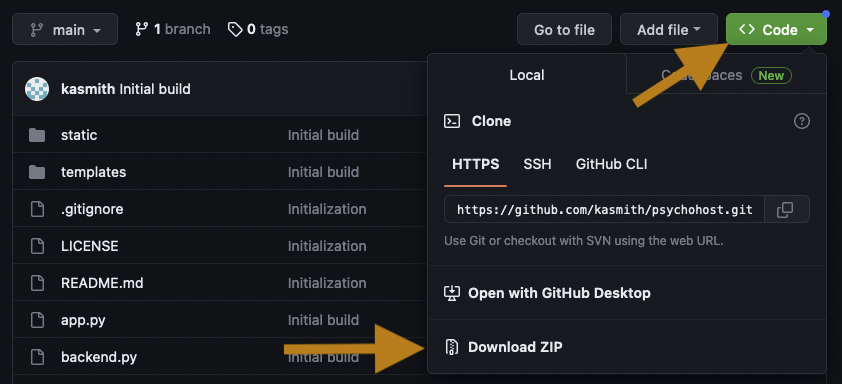

# psychohost
A lightweight framework for hosting JSPsych experiments using Flask

Really only need to know jspsych, networking, a bit of python

Benefits:
* flexible
* don't worry about backend
* no double subjects (but do have debug)
* plugins to mturk / profilic (?)

Philosophy: use for experiment groups

Currently using JSPsych@7.3.2

## Quickstart

1) Download and unzip the psychohost framework

2) Use the Terminal to navigate to that folder and use the following command to install the required Python dependencies (you may want to use a package manager like [Virtual Environments](https://packaging.python.org/guides/installing-using-pip-and-virtual-environments/#creating-a-virtual-environment) or [Conda](https://www.anaconda.com/products/individual))

> `pip install -r requirements.txt`

3) Start the service in debug mode with the following command

> `python app.py`

4) Try the example experiment out by navigating to `127.0.0.1:5002/example_exp/debug/` in a web browser

## Setup

* install requirements.txt
* setup config, consent
* write experiment in jspsych
* add experiment config
* serve

## Writing experiments

Go through template

* adding plugins via experiment config
* utility functions
* wrapping in async (see template)
* using `context` decorator for output
* dealing with mturk/prolific

## Working with data

* download script
* downloading into python

## Customization

* using custom plugins
* upgrading jspsych

